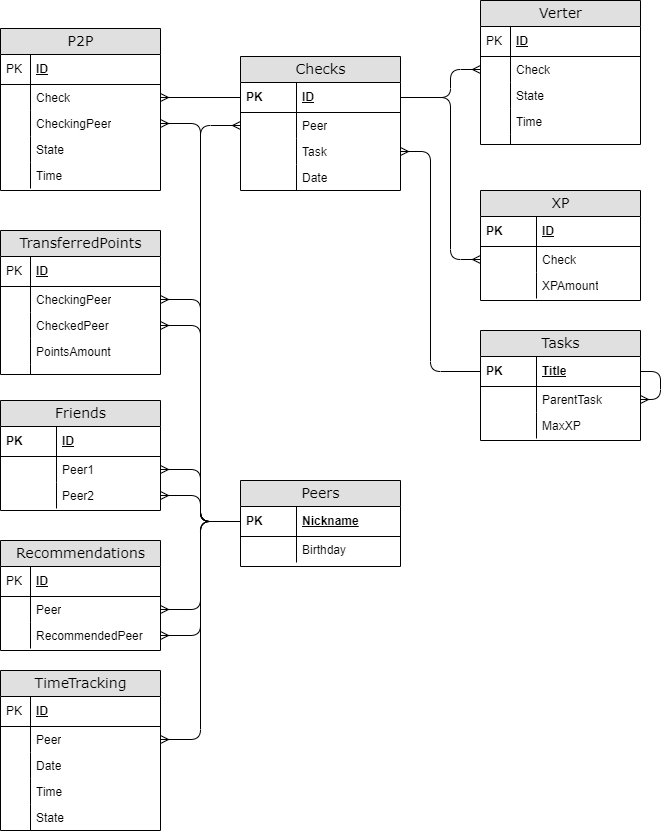

# SQL Project "Information about students in school 21"

Data analysis and statistics for School 21.

## Chapter I
## Introduction

To create my database about School 21, I first needed to determine which tables and columns to include. I decided on having tables for students, projects, and xp, with corresponding columns for each piece of relevant information.

Once I had set up my database, I began writing procedures and functions to retrieve information from it. 
To modify the data in my database, I wrote procedures and triggers that updated or deleted information as needed. Overall, the success of my database project depended on careful planning of its structure, as well as clear and well-documented procedures and functions to effectively retrieve and modify the data.

  

